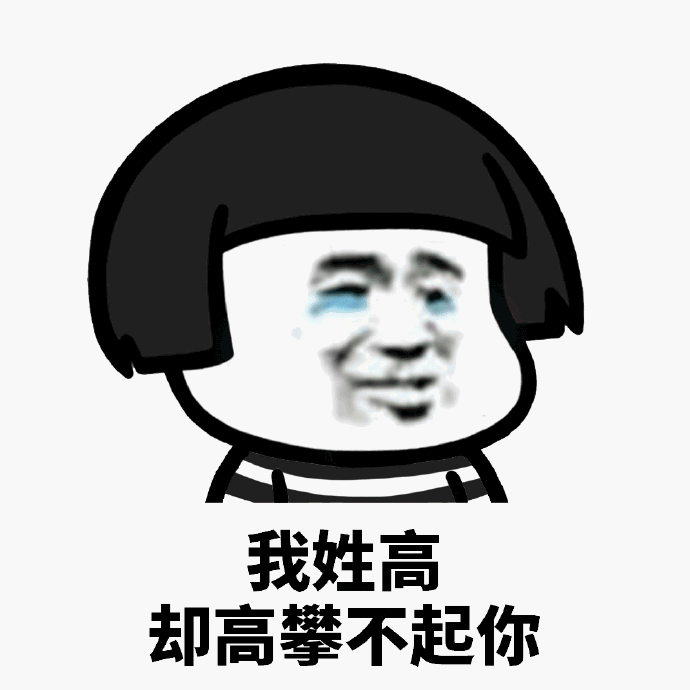
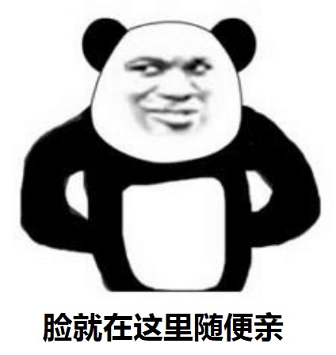
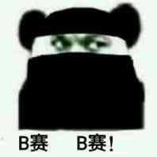
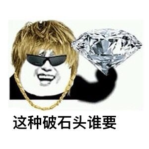

## incisive

形容词 深刻的、尖锐的

这是一个深刻的尴尬，没脸见人了。

## amateur

名词 业余爱好者

阿妈特然，是个业余的掏坟人。

## chateau

名词 城堡、别墅

什么，去年买了个堡，还是城堡？

## genre

名词 类型 风格 体裁

不一样的老司机风格

## intimate

形容词 亲密的 （知识）渊博的

论如何知识渊博的转币。

## deficit

名词 亏损

你可能小赚，但我永远不亏。

## strand

名词 缕

一缕情丝绕心头

## float

动词 飘，浮动

你这人很飘

## defrost

及物动词 使...解冻

解冻的肉才能吃

## informal

形容词 随便

## chart

及物动词 制图

除了智障，还有制图

## championship

名词 锦标赛

## discrimination

名词 区别 歧视

## facade

名词 表面、明面

肥塞德

## margin

名词 边缘 余地

## resource

名词 资源 财力 办法

## roughly

副词 大概地 大致地

## foul

形容词 肮脏的

## caret

名词 克拉

再来 200 克拉

## decay

名词 衰退

老了，跑不动了。

